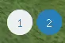
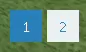

# Visual Ticks

This plugin adds a customisable visual tick overlay. 

There are 3 shapes to pick from.

Rounded squares are the third option, but due to quality loss look the same as squares in gifs!

You can have up to 3 different tick configurations at once.

Tabs can be toggled to only show whilst on specific tabs.

